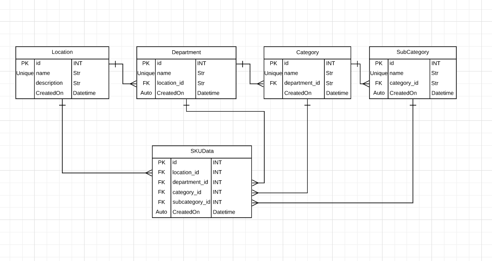

- cd store-project
- conda create -n sku-project-env python=3.8
- conda activate ku-project-env
- pip install -r requirements.txt
- python manage.py runserver

    # APIs List(Sample):

    1. all Locations GET, POST:
        1. <http://localhost:8000/api/v1/location/>
        1. <http://localhost:8000/api/v1/location/1/department/>
        1. <http://localhost:8000/api/v1/location/1/department/1/category/>
        1. <http://localhost:8000/api/v1/location/1/department/1/category/1/subcategory/>
    2. specific location details GET, PUT, PATCH, DELETE, HEAD, OPTIONS:
        1. <http://localhost:8000/api/v1/location/1/>
        2. <http://localhost:8000/api/v1/location/1/department/1/>
        3. <http://localhost:8000/api/v1/location/1/department/1/category/1/>
        4. <http://localhost:8000/api/v1/location/1/department/1/category/1/subcategory/123/>

    3. SKU search api:
        http://localhost:8000/api/v1/skus/?location=Perimeter&department=Bakery&category=Bakery%20Bread&subcategory=Bagels

# DB Schema

